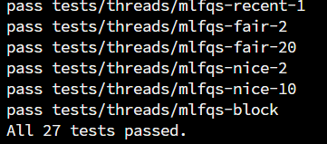
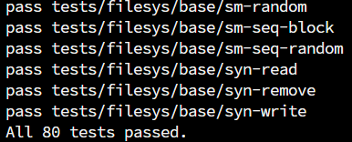
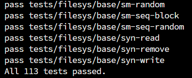
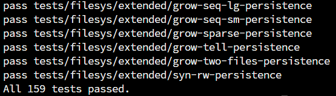

- # Pintos

  [English version](./README.md)

  这个仓库包含了[Pintos](https://pintos-os.org/)的参考解答示例代码和授课[Beamer资源](./beamer)。

  [Pintos](http://pintos-os.org) 是一个面向 32 位 x86 的教学操作系统，具有挑战性但不过于复杂，其设计简洁却足够深入理解操作系统原理（可在 QEMU、Bochs、VMWare Player 等模拟器或真实 x86 机器上运行）。主代码、文档和实验任务由斯坦福大学的 Ben Pfaff 等人开发。

  ## 项目内容

  该仓库已经实现了Pintos的全部项目，包括：
  ### Project 0 Getting Real
  - [beamer](./beamer/OSLab-Project0/main.pdf)
  - Task 1: Booting Pintos
  - Task 2: Debugging
  - Task 3: Kernel Monitor
  ### Project 1 Threads
  - [beamer](./beamer/OSLab-Project1/OSLab_Project1.pdf)
  - Task 1: Alarm Clock
  - Task 2: Priority Scheduling
  - Task3: Advanced Scheduler
  ### Project 2 User Programs
  - [beamer](./beamer/OSLab-Project2/OSLab_Project2.pdf)
  - Task 1: Process Termination Messages
  - Task 2: Argument Passing
  - Task 3: Accessing User Memory
  - Task 4: System Calls
  - Task 5: Denying Writes to Executables
  ### Project 3 Virtual Memory
  - [beamer](./beamer/OSLab-Project3/OSLab_Project3.pdf)
  - Task 1: Paging
  - Task 2: Accessing User Memory
  - Task 3: Stack Growth
  - Task 4: Memory Mapped Files
  ### Project 4 File Systems
  - [beamer](./beamer/OSLab-Project4/OSLab_Project4.pdf)
  - Task 1: Indexed and Extensible Files
  - Task 2: Subdirectories
  - Task 3: Buffer Cache
  - Task 4: Synchronization

  此外，`beamer` 文件夹中包含了我授课使用的 Beamer 幻灯片及其对应的 LaTeX 源代码。

  ## 用途与说明

  这个仓库是为武汉大学操作系统课程实验设计的授课仓库，包含最终实现的参考源代码、上课使用的 Beamer 幻灯片，以及几个实验结果的截图:

  |  |  |
  |----------------------------|----------------------------|
  |  |  |

  需要注意的是，在我的实现中，驱逐物理页时，只能驱逐当前进程的物理页，不能驱逐其他进程的。如果希望基于此代码再次开发，这是一个可以优化的地方。

  **不建议**直接使用此代码提交实验任务。

  ## 致谢

  - 此代码基于的[源代码](https://github.com/ryanphuang/PintosM)改编自约翰霍普金斯大学（JHU）的 [Ryan Huang](huang@cs.jhu.edu) 教授，他教授了类似的本科操作系统课程，并对原始 Pintos 实验进行了调整（增加了 Lab0 并修复了 MacOS 的一些错误）。
  - [北京大学的版本](https://github.com/PKU-OS/pintos)对文档问题、代码风格和脚本进行了部分调整，同时提供了测试的Docker环境，方便学生进行测试。
