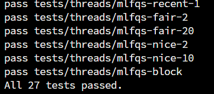
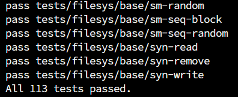
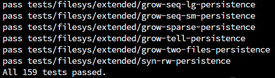

# Pintos

[中文版本](./README-cn.md)

This repository contains reference solution example code and [Beamer resources](./beamer) for the operating systems course experiments [Pintos](https://pintos-os.org/) at Wuhan University. The experiments are adapted from the framework code of Peking University's undergraduate operating systems honor track program.

[Pintos](http://pintos-os.org) is an educational operating system targeting 32-bit x86 architectures. It provides a challenging yet manageable complexity, with a simple yet sufficient design to understand operating system principles (runnable on emulators like QEMU, Bochs, VMWare Player, or physical x86 machines). The main codebase, documentation, and project tasks were developed by Ben Pfaff from Stanford University and others.

## Project Content

This repository has implemented all Pintos projects, including:

### Project 0 Getting Real

- [Beamer](./beamer/OSLab-Project0/main.pdf)
- Task 1: Booting Pintos
- Task 2: Debugging
- Task 3: Kernel Monitor

### Project 1 Threads

- [Beamer](./beamer/OSLab-Project1/OSLab_Project1.pdf)
- Task 1: Alarm Clock
- Task 2: Priority Scheduling
- Task 3: Advanced Scheduler

### Project 2 User Programs

- [Beamer](./beamer/OSLab-Project2/OSLab_Project2.pdf)
- Task 1: Process Termination Messages
- Task 2: Argument Passing
- Task 3: Accessing User Memory
- Task 4: System Calls
- Task 5: Denying Writes to Executables

### Project 3 Virtual Memory

- [Beamer](./beamer/OSLab-Project3/OSLab_Project3.pdf)
- Task 1: Paging
- Task 2: Accessing User Memory
- Task 3: Stack Growth
- Task 4: Memory Mapped Files

### Project 4 File Systems

- [Beamer](./beamer/OSLab-Project4/OSLab_Project4.pdf)
- Task 1: Indexed and Extensible Files
- Task 2: Subdirectories
- Task 3: Buffer Cache
- Task 4: Synchronization

The `beamer` folder contains the Beamer slides used for teaching along with their LaTeX source code.

## Usage Notes

This repository is designed for Wuhan University's operating systems course experiments. It includes:
- Reference implementation source code
- Beamer presentation slides
- Screenshots of experimental results:

|  |  |
| --------------------------- | --------------------------- |
|  |  |

**Important Notes:**
- When evicting physical pages, only the current process's pages are considered - other processes' pages cannot be evicted.
- These is a potential optimization area if further development is needed.
- **Direct submission of this code for course assignments is strongly discouraged.**

## Acknowledgments

- The original source code framework was adapted from [PintosM](https://github.com/ryanphuang/PintosM) by [Prof. Ryan Huang](huang@cs.jhu.edu) from Johns Hopkins University, who taught a similar undergraduate OS course and modified the original Pintos labs (added Lab0 and fixed macOS compatibility issues).
- Peking University's version ([pintos](https://github.com/PKU-OS/pintos)) improved documentation, coding standards, scripts, and provided a Docker testing environment for students.
